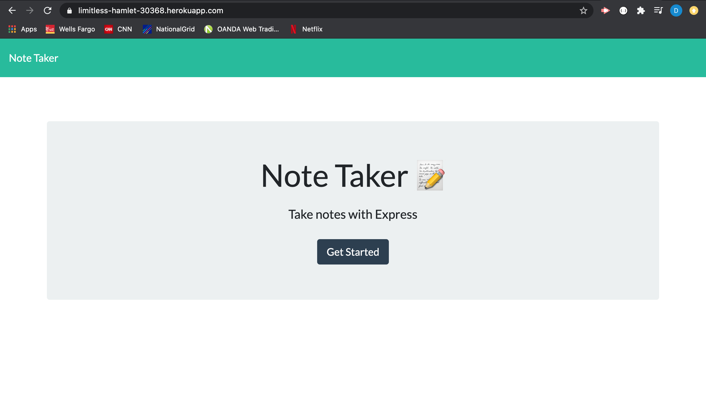

# Note-Taker

## Description

This is an application that can be used to write, save, and delete notes.This application uses an express backend that saves and retrieves note data from a JSON file.

**## Table of Contents**

1. [Installation Instructions](#installation-instructions)
2. [Usage Information](#usage-information)
3. [Test Instructions](#test-instructions)
4. [Questions](#questions)

## Installation Instructions

To install this application, run the command 'npm i' in your integrated terminal to ensure all dependencies are downloaded locally.

## Usage Information

View the application: <a href="https://limitless-hamlet-30368.herokuapp.com/">https://limitless-hamlet-30368.herokuapp.com/</a>

## Test Instructions

This application does not currently have any testing suites.

# Questions

For any questions about this assignment, feel free to reach out to me on github or my email. Thank you for viewing this application.

https://github.com/dolanpettit

dolanpettit@gmail.com
